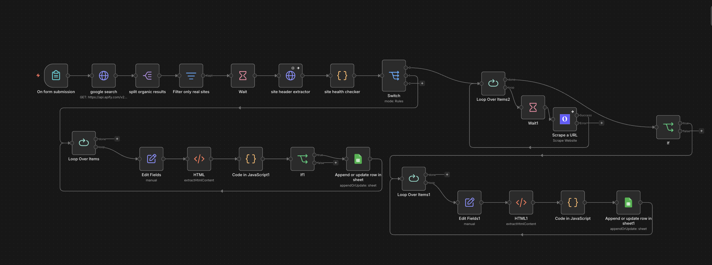

# Decoupled Agentic Lead Pipeline

[](https://doi.org/10.5281/zenodo.20103300)

## Abstract

We present a modular, agentic lead-generation pipeline built on n8n that automates the end-to-end process of identifying, enriching, and engaging prospects through AI-driven personalization. The system decouples each stage—data collection, AI extraction, outreach delivery, open tracking, and reply monitoring—enabling independent optimization and replacement of pipeline components. Operating on commodity hardware (M4 Pro) with containerized orchestration (Docker), this pipeline achieves a unit cost of $0.02 per qualified lead while maintaining personalization at scale.

## System Architecture

The pipeline leverages three core technologies:

- **n8n**: Open-source workflow automation engine that orchestrates the entire pipeline
- **Docker**: Containerized deployment enabling reproducibility and portability
- **M4 Pro Hardware**: Demonstrates efficient execution on consumer-grade processors

Each workflow stage can be imported, modified, and tested independently within n8n, allowing researchers and practitioners to swap components without full system restructuring.

## Unit Economics

This system achieves a cost of **$0.02 per qualified lead** through:
- Efficient API usage (Google Search via Apify)
- Minimal compute overhead (M4 Pro-grade hardware)
- Consolidated email delivery (Gmail integration)
- Lightweight tracking infrastructure

## Architecture Overview



## Workflow Map

### 1. Data Collection

[workflows/data collection.json](workflows/data%20collection.json)

Starts with a form called **Lead Machine**. It collects the business type, location, lead count, and preferred email style. The workflow then queries Google search via Apify, splits organic results, filters out directories and job boards, and checks whether a site looks real before letting the lead continue.

### 2. AI Extraction

[workflows/ai extraction.json](workflows/ai%20extraction.json)

Uses Gemini-powered extraction and validation to turn a scraped lead into usable outbound data. It also performs sanity checks on email and name fields before updating the extracted-data sheet.

### 3. Outreacher

[workflows/outreacher.json](workflows/outreacher.json)

Builds the cold email, adds a tracking pixel, sends the message through Gmail, and marks the lead as sent in the outreach sheet.

### 4. Webhook Trigger

[workflows/webhook trigger.json](workflows/webhook%20trigger.json)

Handles open tracking. A webhook receives the pixel hit, calculates the time delta, marks the lead as seen, and returns a 1x1 transparent GIF so the email loads cleanly.

### 5. Reply Checker

[workflows/reply checker.json](workflows/reply%20checker.json)

Polls Gmail for inbound replies, matches them back to the lead sheet, updates the lead status to replied, and posts a Slack notification.

### 6. Error Handler

[workflows/error handler.json](workflows/error%20handler.json)

Listens for workflow errors and sends a Slack alert with the workflow name, failing node, and execution link.

## Folder Structure

```text
decoupled-agentic-pipeline/
├── README.md
├── docs/
│   └── architecture-diagram.png
└── workflows/
	├── ai extraction.json
	├── data collection.json
	├── error handler.json
	├── outreacher.json
	├── reply checker.json
	└── webhook trigger.json
```

## End-to-End Flow

1. Submit the form in **Data Collection**.
2. Search results are scraped and filtered down to real business websites.
3. Lead data is enriched and validated in **AI Extraction**.
4. **Outreacher** drafts and sends a personalized email.
5. Open events hit **Webhook Trigger** and update the status to seen.
6. Replies are detected by **Reply Checker** and marked as replied.
7. Any failure anywhere is reported by **Error Handler**.

## Notes

- The workflows are intentionally decoupled so each stage can be swapped without rewriting the whole system.
- Several nodes reference existing Google Sheets, Gmail, Slack, and Apify credentials inside n8n.
- The repository contains workflow exports only; import them into your n8n instance to run the pipeline.

## Installation

### Prerequisites

- n8n instance (self-hosted or cloud)
- Google Sheets account
- Gmail account with app password enabled
- Slack workspace (for error notifications)
- Apify account (for web scraping)
- Docker (recommended for deployment)

### Importing Workflows

1. **Download the workflow files** from the `workflows/` directory in this repository.
2. **In n8n**, navigate to **Workflows** → **Import from file**.
3. **Import each .json file** in this order:
   - `data collection.json`
   - `ai extraction.json`
   - `outreacher.json`
   - `webhook trigger.json`
   - `reply checker.json`
   - `error handler.json`
4. **Configure credentials** in each workflow:
   - Google Sheets credentials
   - Gmail credentials (app password)
   - Slack webhook URL
   - Apify API key
   - Webhook domain (for open tracking pixel)
5. **Link sheets and trigger nodes** to your own Google Sheets and endpoints.
6. **Test** with a small batch of leads before scaling.

### Docker Deployment

To run n8n with this pipeline in Docker:

```bash
docker run -it --rm \
  -p 5678:5678 \
  -v ~/.n8n:/home/node/.n8n \
  n8nio/n8n
```

Import the workflows via the UI, then configure your credentials and environment variables.

## License

This project is licensed under the MIT License. See the [LICENSE](../LICENSE) file in the root directory for details.

## Citation

If you use this pipeline in your research, please cite:

```bibtex
@software{decoupled_agentic_pipeline,
  title={Decoupled Agentic Lead Pipeline},
  doi={10.5281/zenodo.20103300},
  year={2026}
}
```
